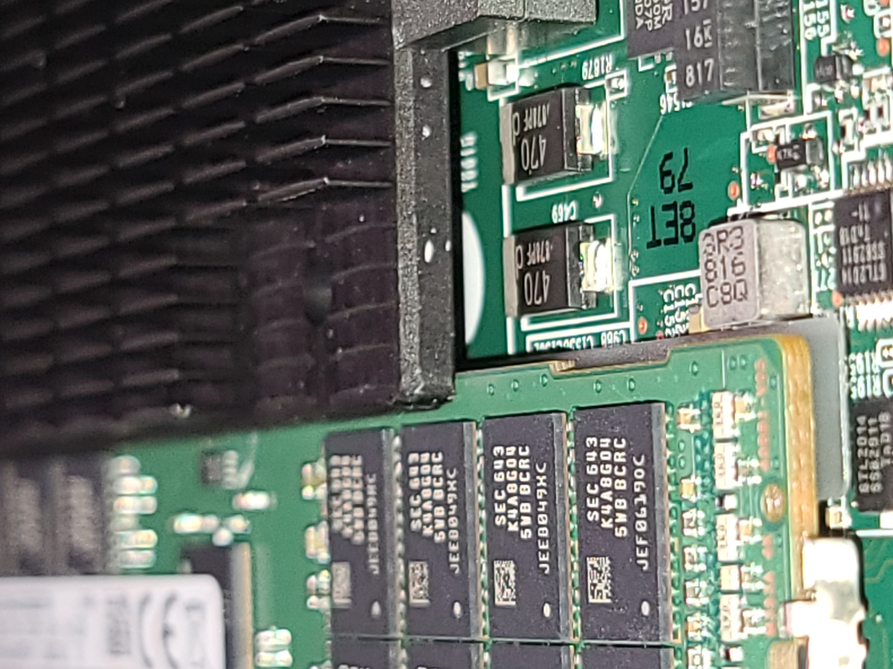

# HPE_M510

Tools and notes for working with HPE M510 Moonshot cartridges.

## Introduction

The [HPE ProLiant
M510](https://h20195.www2.hpe.com/v2/getdocument.aspx?docname=c05069171)
is a small blade-like cartidge computer that can be used with several
chassis in the HPE Moonshot family, including the 45-slot 4.3U
[Moonshot 1500
chassis](https://h20195.www2.hpe.com/v2/getdocument.aspx?docname=c04111337),
the 4-slot 1U [EL4000
chassis](https://h20195.www2.hpe.com/v2/Getdocument.aspx?docname=c05211200),
and the 1-slot
[EL1000](https://h20195.www2.hpe.com/v2/getdocument.aspx?docname=c05211199[).

The M510 comes with either an 8- or 16-core Broadwell [Xeon D
CPU](https://en.wikipedia.org/wiki/List_of_Intel_Broadwell-based_Xeon_microprocessors#Xeon_D-15xx_(uniprocessor,_SoC)),
4 DIMM slots, and room for up to 3 M.2 SSDs (2 NVMe, 1 SATA).

## Known-working Peripherals

### Memory

* Samsung 32GB PC4-2400T-R DDR4 ECC RDIMM (M393A4K40BB1-CRC0Q)

This is what I had at hand, and have used with other Xeon-D boards.
Seems to work fine.  HP's iLO correctly identifies it as non-HPE RAM,
but doesn't otherwise complain.

### SSDs

* Samsung 970 EVO
* Sabrent Rocket 4.0

I suspect that anything sane will work fine.

## Heat Sinks

Many used M510 cartridges come without heatsinks or the mounting base
plate that holds the heatsinks in place.  Replacement HPE heat sinks
are generally unavailable online, and (as of February 2021) list for
more than the current selling price of M510 cartridges.

The heatsink base plate also contains the mounting points for the M.2
cards on the bottom side of the cartridge.  So, without a baseplate,
there's no safe way to mount M.2s.

I have been working on sourcing a workable replacement for both the
heatsink and the baseplate.  As of March 2021, they both seem to work
well enough for my uses.

For the base plate, I've designed a custom 3D-printable version and
included a STL [here](M510+Heatsink_Mount.stl').  This is designed to
connect to the heatsink using M3 screws which thread directly into the
plastic of the baseplate.  I'd generally prefer to use threaded brass
inserts, but there is only a tiny amount of clearance between the
baseplate and the second DIMM slot, and every single brass insert that
I can find is too thick.

The plate can be printed on any 3D printer, although the M510 may get
hot enough for PLA to fail.  I ended up having Shapeways print a few
using SLS-fused nylon for around $15 each.  Printing in ABS would
almost certainly be fine and be much cheaper.

The baseplate has room for up to 3 M.2 SSDs.  The two NVMe-compatible
slots have screw holes for 2280 and 22110 cards.  One of them also has
a hole for a 2260 M.2.  In addition, the SATA M.2 slot can fit either
a 2242 or 2260 card.  The M.2 cards should be screwed in using a short
M2 screw with a plastic washer.  Either 3mm or 4mm screws should work
when used with a washer.

Here's what I'm using, but any similar screw should work.

* [M2 3mm pan-head phillips screw](https://www.mcmaster.com/90116A007/)
* [M2 plastic washer](https://www.mcmaster.com/95610A510/)

Make sure that you screw doesn't go throught the baseplate and into
the motherboard.  The baseplate is 3mm thick and M.2s are generally
1mm thick, so a 4mm screw+washer is the maximum that should be used.

The baseplate was designed in Fusion 360.  [My
design](https://a360.co/3drTb7T) is available if you wish to make
modifications.

I was unable to find any pre-made heatsinks with the right hole
placement, so I ordered a batch of semi-custom heatsinks from
[Alpha](https://www.alphanovatech.com/).  They cut one of their
standard heatsink stocks down to size, milled 4 holes, shaved 1mm off
the thickness, annodized the whole thing, and added a thermal
interface to the back, all for around $35 each quantity 5.

They assigned this heatsink a part number of `S08EKD03-A`.  It should
be possible to order additional copies of this part number directly
from them.  If ordered in quantity, the price drops quite a bit;
quantity 50 they're under $10 each.

This revision of the heatsink is *slightly* wider than it should
probably be, as it interferes slightly with the second DIMM on the CPU
side of the M510 board.  If you wish to use both DIMMs, then you'll
probably need to remove the heatsink in order to install the second
DIMM, although you can re-install it after and it should *barely*
clear the top of the DIMM.  See image below.

### Images

## Resources

Additional resources:

* [ServeTheHome.com's Moonshot Unofficial Reference
  Guide](https://forums.servethehome.com/index.php?resources/hp-hpe-moonshot-unofficial-reference-guide.19/)